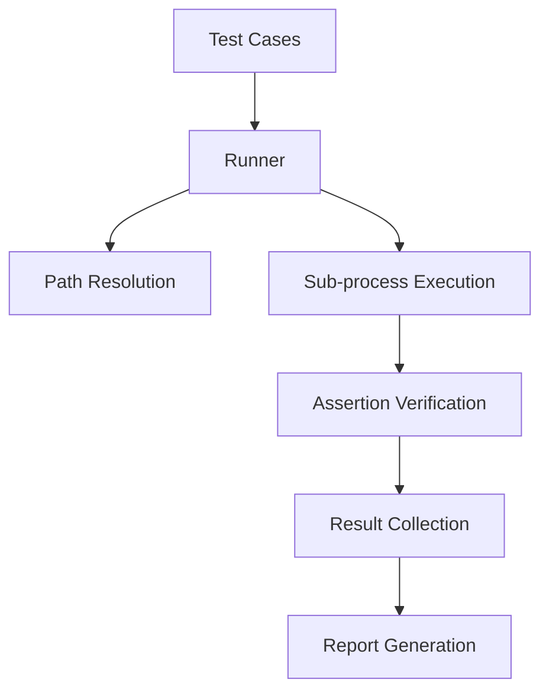

# Command line Testing Framework Development Documentation

## 1. Overview

This testing framework is a lightweight and extensible automated testing solution that supports defining test cases via JSON/YAML formats, providing complete test execution, result verification, and report generation capabilities. The core objective is to provide standardized test management capabilities for command-line tools and scripts, supporting cross-platform testing scenarios.

## 2. Features

- **Modular Architecture**: Decoupled design of core components (runner/assertion/report)
- **Multi-Format Support**: Native support for JSON/YAML test case formats
- **Intelligent Path Resolution**: Automatic handling of relative and absolute path conversions
- **Rich Assertion Mechanism**: Includes return value validation, output content matching, regular expression verification
- **Extensible Interfaces**: Quickly implement new test format support by inheriting BaseRunner
- **Isolated Execution Environment**: Independent sub-process execution ensures test isolation
- **Diagnostic Reports**: Provides pass rate statistics and failure detail localization

## 3. Usage Instructions

### Environment Requirements

```Bash
pip install -r requirements.txt
Python >= 3.6
```

### Quick Start

1. Create test case files (examples in `tests/fixtures/`)
2. Write an execution script:

```Python
from src.runners.json_runner import JSONRunner

runner = JSONRunner(
    config_file="path/to/test_cases.json",
    workspace="/project/root"
)
success = runner.run_tests()
```

### Test Case Format Examples

**JSON Format**:

```JSON
{
    "test_cases": [
        {
            "name": "File Comparison Test",
            "command": "diff",
            "args": ["file1.txt", "file2.txt"],
            "expected": {
                "return_code": 0,
                "output_contains": ["identical"]
            }
        }
    ]
}
```

**YAML Format**:

```YAML
test_cases:
    - name: Directory Scan Test
      command: ls
      args:
        - -l
        - docs/
      expected:
        return_code: 0
        output_matches: ".*\.md$"
```

## 4. System Flow

### Architecture Modules



### Core Module Description

1. **Test Runner**

   - Loads test configurations
   - Manages test lifecycle
   - Coordinates component collaboration

2. **PathResolver**

   ```Python
   def resolve_paths(args):
       return [workspace/path if not flag else arg for arg in args]
   ```

   Intelligently handles path parameters, automatically converting relative paths to absolute paths based on the workspace.

3. **Assertion Engine**

   - Return value validation (return_code)
   - Output content matching (contains/matches)
   - Exception capture mechanism

4. **Report Generator**

   - Real-time test progress statistics
   - Generates detailed reports with error localization
   - Supports console output and file saving

## 5. Detailed Code Implementation

### Core Class Description

**TestCase Data Class**:

```Python
@dataclass
class TestCase:
    name: str          # Test name
    command: str       # Execution command/program
    args: List[str]    # Argument list
    expected: Dict[str, Any] # Expected results
```

**BaseRunner Abstract Class**:

```Python
def run_tests(self) -> bool:
    self.load_test_cases()
    for case in self.test_cases:
        result = self.run_single_test(case)
        # Result collection logic...
    return self.results["failed"] == 0
```

**JSONRunner Implementation**:

```Python
def load_test_cases(self):
    with open(config_path) as f:
        cases = json.load(f)["test_cases"]
        # Field validation and path preprocessing
        case["command"] = self.path_resolver.resolve_command(case["command"])
```

**Assertion Subsystem**:


```Python
class Assertions:
    @staticmethod
    def matches(text, pattern):
        if not re.search(pattern, text):
            raise AssertionError(f"Pattern mismatch: {pattern}")
```

## 6. Robustness Design

### Reliability Assurance Measures

- **Input Validation**: Enforces validation of required test case fields

- **Error Isolation**: Individual test failures do not affect subsequent executions

- **Sub-process Protection**:

  ```Python
  subprocess.run(..., check=False, shell=True)
  ```
  
- **Path Security**: Automatically handles path separator differences

- **Exception Capture**: Three-level error handling (assertion error/execution error/system error)

- **Result Integrity**: Ensures all test results are recorded

## 7. Extensibility Design

### Extension Directions

1. **Format Extension**: Implement XMLRunner/TomlRunner
2. **Executor Extension**: Support Docker/SSH remote execution
3. **Assertion Extension**: Add performance metric assertions
4. **Report Format**: Support HTML/PDF report generation
5. **Distributed Execution**: Multi-process parallel testing

Extension Example (adding XML runner):

```Python
class XMLRunner(BaseRunner):
    def load_test_cases(self):
        import xml.etree.ElementTree as ET
        # Parse XML structure and convert to TestCase objects
```

## 8. Example Demonstration

### Input Example

```JSON
{
    "test_cases": [
        {
            "name": "Version Check Test",
            "command": "python",
            "args": ["--version"],
            "expected": {
                "output_matches": "Python 3\\.[89]\\.",
                "return_code": 0
            }
        }
    ]
}
```

### Output Report

```
Test Results Summary:
Total Tests: 1
Passed: 1 (100.0%)
Failed: 0 (0.0%)

Detailed Results:
✓ Version Check Test
```

## 9. Precautions

1. Path Handling:

   - Parameters starting with `--` will not be path-converted
   - Windows paths should use `/` or escaped `\\`
   
2. Command Limitations:

   - Only single command execution is supported
   - Complex pipelines need to be encapsulated into scripts
   
3. Security Specifications:

   - Do not run with root privileges
   - Prohibit execution of untrusted test cases
   
4. Performance Notes:

   - Single test timeout is unlimited by default
   - I/O intensive tests are recommended to control concurrency themselves
   
5. Environment Dependencies:

   - Tested programs need to be pre-installed
- Python path needs to be in the system PATH