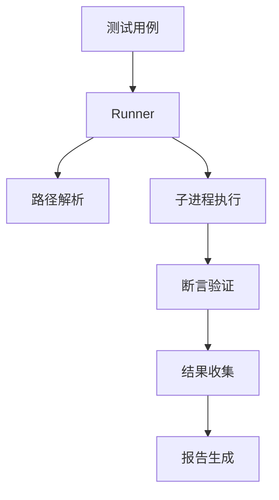

# Command line 测试框架开发文档

## 1. 概述
本测试框架是一个轻量级、可扩展的自动化测试解决方案，支持通过JSON/YAML格式定义测试用例，提供完整的测试执行、结果验证和报告生成功能。核心目标是为命令行工具和脚本提供标准化的测试管理能力，支持跨平台测试场景。

## 2. 功能特点
- **模块化架构**：核心组件解耦设计（运行器/断言/报告）
- **多格式支持**：原生支持JSON/YAML测试用例格式
- **智能路径解析**：自动处理相对路径与绝对路径转换
- **丰富断言机制**：包含返回值校验、输出内容匹配、正则表达式验证
- **可扩展接口**：通过继承BaseRunner可快速实现新测试格式支持
- **执行环境隔离**：独立子进程运行保证测试隔离性
- **诊断报告**：提供通过率统计和失败详情定位

## 3. 使用说明

### 环境要求
```bash
pip install -r requirements.txt
Python >= 3.6
```

### 快速开始

1. 创建测试用例文件（示例见`tests/fixtures/`）
2. 编写执行脚本：

```python
from src.runners.json_runner import JSONRunner

runner = JSONRunner(
    config_file="path/to/test_cases.json",
    workspace="/project/root"
)
success = runner.run_tests()
```

### 测试用例格式示例

**JSON格式**：

```json
{
  "test_cases": [
    {
      "name": "文件比对测试",
      "command": "diff",
      "args": ["file1.txt", "file2.txt"],
      "expected": {
        "return_code": 0,
        "output_contains": ["identical"]
      }
    }
  ]
}
```

**YAML格式**：

```yaml
test_cases:
  - name: 目录扫描测试
    command: ls
    args: 
      - -l
      - docs/
    expected:
      return_code: 0
      output_matches: ".*\.md$"
```

## 4. 系统流程

### 架构模块



### 核心模块说明

1. **Test Runner**

   - 加载测试配置
   - 管理测试生命周期
   - 协调各组件协作

2. **PathResolver**

   ```python
   def resolve_paths(args):
       return [workspace/path if not flag else arg for arg in args]
   ```

   智能处理路径参数，自动将相对路径转换为基于workspace的绝对路径

3. **Assertion Engine**

   - 返回值校验（return_code）
   - 输出内容匹配（contains/matches）
   - 异常捕获机制

4. **Report Generator**

   - 实时统计测试进度
   - 生成带错误定位的详细报告
   - 支持控制台输出和文件保存

## 5. 代码实现详解

### 核心类说明

**TestCase 数据类**：

```python
@dataclass
class TestCase:
    name: str          # 测试名称
    command: str       # 执行命令/程序
    args: List[str]    # 参数列表
    expected: Dict[str, Any]  # 预期结果
```

**BaseRunner 抽象类**：

```python
def run_tests(self) -> bool:
    self.load_test_cases()
    for case in self.test_cases:
        result = self.run_single_test(case)
        # 结果收集逻辑...
    return self.results["failed"] == 0
```

**JSONRunner 实现**：

```python
def load_test_cases(self):
    with open(config_path) as f:
        cases = json.load(f)["test_cases"]
        # 字段校验和路径预处理
        case["command"] = self.path_resolver.resolve_command(case["command"])
```

**断言子系统**：

```python
class Assertions:
    @staticmethod
    def matches(text, pattern):
        if not re.search(pattern, text):
            raise AssertionError(f"Pattern mismatch: {pattern}")
```

## 6. 健壮性设计

### 可靠性保障措施

- **输入验证**：强制校验测试用例必填字段

- **错误隔离**：单个测试失败不影响后续执行

- **子进程防护**：

  ```python
  subprocess.run(..., check=False, shell=True)
  ```

- **路径安全**：自动处理路径分隔符差异

- **异常捕获**：三级错误处理（断言错误/执行错误/系统错误）

- **结果完整性**：确保所有测试结果都被记录

## 7. 扩展性设计

### 扩展方向

1. **格式扩展**：实现XMLRunner/TomlRunner
2. **执行器扩展**：支持Docker/SSH远程执行
3. **断言扩展**：添加性能指标断言
4. **报告格式**：支持HTML/PDF报告生成
5. **分布式执行**：多进程并行测试

扩展示例（新增XML运行器）：

```python
class XMLRunner(BaseRunner):
    def load_test_cases(self):
        import xml.etree.ElementTree as ET
        # 解析XML结构并转换为TestCase对象
```

## 8. 示例演示

### 输入样例

```json
{
  "test_cases": [
    {
      "name": "版本检查测试",
      "command": "python",
      "args": ["--version"],
      "expected": {
        "output_matches": "Python 3\\.[89]\\.",
        "return_code": 0
      }
    }
  ]
}
```

### 输出报告

```
Test Results Summary:
Total Tests: 1
Passed: 1 (100.0%)
Failed: 0 (0.0%)

Detailed Results:
✓ 版本检查测试
```

## 9. 注意事项

1. **路径处理**：
   - 使用`--`开头的参数不会被路径转换
   - Windows路径需使用`/`或转义`\\`
2. **命令限制**：
   - 仅支持单命令执行
   - 复杂管道需封装为脚本
3. **安全规范**：
   - 不要以root权限运行
   - 禁止执行不可信测试用例
4. **性能注意**：
   - 单个测试超时默认无限制
   - 建议I/O密集型测试自行控制并发
5. **环境依赖**：
   - 需预先安装被测程序
   - Python路径需在系统PATH中