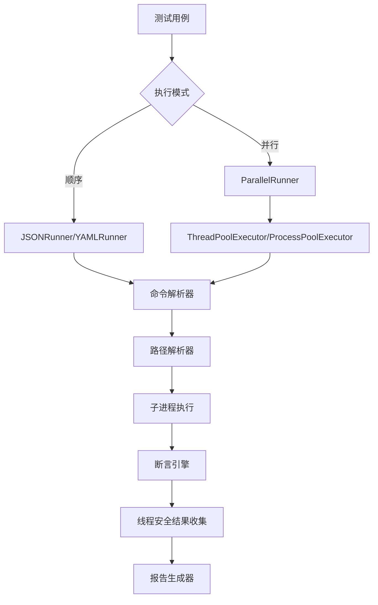
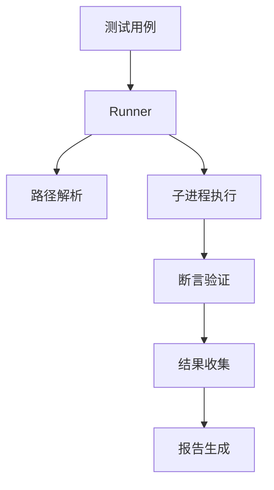

# CLI 测试框架

## 1. 概述
这是一个轻量级、可扩展的自动化测试框架，支持通过JSON/YAML格式定义测试用例，提供完整的测试执行、结果验证和报告生成功能。框架专为命令行工具和脚本提供标准化测试管理，具备企业级并行执行支持。

## 2. 功能特点
- **🚀 并行测试执行**：支持多线程和多进程并行测试，显著提升执行效率
- **🏗️ 模块化架构**：核心组件解耦设计（运行器/断言/报告）
- **📄 多格式支持**：原生支持JSON/YAML测试用例格式
- **🧠 智能命令解析**：智能处理复杂命令如 `"python ./script.py"`
- **📁 智能路径解析**：自动处理相对路径与绝对路径转换
- **✅ 丰富断言机制**：返回值校验、输出内容匹配、正则表达式验证
- **🔌 可扩展接口**：通过继承BaseRunner可快速实现新测试格式支持
- **🔒 执行环境隔离**：独立子进程运行保证测试隔离性
- **📊 全面报告**：详细的通过率统计和失败诊断
- **🔧 线程安全设计**：稳健的并发执行和适当的同步机制

## 3. 使用说明

### 环境要求
```bash
pip install -r requirements.txt
Python >= 3.6
```

### 快速开始

1. 创建测试用例文件（示例见`tests/fixtures/`）
2. 编写执行脚本：

**顺序执行**：
```python
from src.runners.json_runner import JSONRunner

runner = JSONRunner(
    config_file="path/to/test_cases.json",
    workspace="/project/root"
)
success = runner.run_tests()
```

**并行执行（新功能！）**：
```python
from src.runners.parallel_json_runner import ParallelJSONRunner

# 多线程执行（推荐用于I/O密集型测试）
runner = ParallelJSONRunner(
    config_file="path/to/test_cases.json",
    workspace="/project/root",
    max_workers=4,           # 最大并发数
    execution_mode="thread"  # 执行模式：thread 或 process
)
success = runner.run_tests()

# 性能比较示例
python parallel_example.py
```

**YAML支持**：
```python
from src.runners.yaml_runner import YAMLRunner

runner = YAMLRunner(
    config_file="path/to/test_cases.yaml",
    workspace="/project/root"
)
success = runner.run_tests()
```

## 4. 测试用例格式

### JSON格式

```json
{
  "test_cases": [
    {
      "name": "文件处理测试",
      "command": "python ./process_files.py",
      "args": ["file1.txt", "file2.txt", "--verbose"],
      "expected": {
        "return_code": 0,
        "output_contains": ["文件处理完成"],
        "output_matches": [".*比较完成.*"]
      }
    }
  ]
}
```

### YAML格式

```yaml
test_cases:
  - name: 目录扫描测试
    command: ls
    args: 
      - -l
      - docs/
    expected:
      return_code: 0
      output_matches: ".*\\.md$"
```

### 支持的命令格式

框架智能处理各种命令格式：

```json
{
    "command": "echo",                    // 简单命令
    "command": "python script.py",       // 命令+脚本
    "command": "node ./app.js --port",   // 复杂命令+参数
}
```

## 5. 并行测试功能

### 性能优势

并行执行带来显著的性能提升：

```bash
# 运行性能比较
python parallel_example.py

# 典型输出：
# 顺序执行时间:     12.45 秒
# 并行执行时间(线程): 3.21 秒 (3.88x 加速)
# 并行执行时间(进程): 4.12 秒 (3.02x 加速)
```

### 执行模式

#### 线程模式（推荐）
- **适用场景**：I/O密集型测试（网络请求、文件操作）
- **优势**：启动快，内存共享，适合大多数测试场景
- **推荐并发数**：CPU核心数 × 2-4

```python
runner = ParallelJSONRunner(
    config_file="test_cases.json",
    max_workers=4,
    execution_mode="thread"
)
```

#### 进程模式
- **适用场景**：CPU密集型测试，需要完全隔离的场景
- **优势**：完全隔离，绕过GIL限制
- **推荐并发数**：CPU核心数

```python
runner = ParallelJSONRunner(
    config_file="test_cases.json",
    max_workers=2,
    execution_mode="process"
)
```

### 线程安全特性

- **结果收集锁**：`threading.Lock()` 保护共享结果数据
- **输出控制锁**：防止并发输出混乱
- **异常隔离**：单个测试失败不影响其他测试

## 6. 系统架构

### 增强的架构流程



### 核心组件

#### 1. 智能命令解析器
```python
# 处理复杂命令如 "python ./script.py"
command_parts = case["command"].split()
if len(command_parts) > 1:
    actual_command = resolve_command(command_parts[0])  # "python"
    script_parts = resolve_paths(command_parts[1:])     # "./script.py" -> 完整路径
    final_command = f"{actual_command} {' '.join(script_parts)}"
```

#### 2. 增强的路径解析器
```python
def resolve_command(self, command: str) -> str:
    system_commands = {
        'echo', 'ping', 'python', 'node', 'java', 'docker', ...
    }
    if command in system_commands or Path(command).is_absolute():
        return command
    return str(self.workspace / command)
```

#### 3. 并行运行器基类
```python
class ParallelRunner(BaseRunner):
    def __init__(self, max_workers=None, execution_mode="thread"):
        self.max_workers = max_workers or os.cpu_count()
        self.execution_mode = execution_mode
        self._results_lock = threading.Lock()
        self._print_lock = threading.Lock()
```

## 7. 高级用法

### 性能测试

```python
# 快速性能测试
python performance_test.py

# 并行功能单元测试
python -m pytest tests/test_parallel_runner.py -v
```

### 错误处理和回退

```python
try:
    runner = ParallelJSONRunner(config_file="test_cases.json")
    success = runner.run_tests()
    
    if not success:
        # 检查失败的测试
        for detail in runner.results["details"]:
            if detail["status"] == "failed":
                print(f"失败的测试: {detail['name']}")
                print(f"错误信息: {detail['message']}")
                
except Exception as e:
    print(f"执行出错: {e}")
    # 回退到顺序执行
    runner.run_tests_sequential()
```

### 最佳实践

1. **选择合适的并发数**：
   ```python
   import os
   
   # CPU密集型任务
   max_workers = os.cpu_count()
   
   # I/O密集型任务
   max_workers = os.cpu_count() * 2
   ```

2. **测试用例设计**：
   - ✅ 确保测试独立性（测试间无依赖关系）
   - ✅ 避免共享资源冲突（不同文件/端口）
   - ✅ 使用相对路径（框架自动处理解析）

3. **调试技巧**：
   ```python
   # 启用详细输出便于调试
   runner = ParallelJSONRunner(
       config_file="test_cases.json",
       max_workers=1,  # 设为1便于调试
       execution_mode="thread"
   )
   ```

## 8. 系统流程

### 架构模块



### 核心模块说明

1. **Test Runner**

   - 加载测试配置
   - 管理测试生命周期
   - 协调各组件协作

2. **PathResolver**

   ```python
   def resolve_paths(args):
       return [workspace/path if not flag else arg for arg in args]
   ```

   智能处理路径参数，自动将相对路径转换为基于workspace的绝对路径

3. **Assertion Engine**

   - 返回值校验（return_code）
   - 输出内容匹配（contains/matches）
   - 异常捕获机制

4. **Report Generator**

   - 实时统计测试进度
   - 生成带错误定位的详细报告
   - 支持控制台输出和文件保存


## 9. 示例演示

### 输入样例

```json
{
    "test_cases": [
        {
            "name": "Python版本检查",
            "command": "python --version",
            "args": [],
            "expected": {
                "output_matches": "Python 3\\.[89]\\.",
                "return_code": 0
            }
        },
        {
            "name": "文件处理测试",
            "command": "python ./process_file.py",
            "args": ["input.txt", "--output", "result.txt"],
            "expected": {
                "return_code": 0,
                "output_contains": ["处理完成"]
            }
        }
    ]
}
```

### 输出报告

```
Test Results Summary:
Total Tests: 15
Passed: 15
Failed: 0

Performance Statistics:
Sequential execution time: 12.45 seconds
Parallel execution time:   3.21 seconds
Speedup ratio:            3.88x

Detailed Results:
✓ Python版本检查
✓ 文件处理测试
✓ JSON比较测试
...
```

## 10. 故障排除

### 常见问题

1. **进程模式序列化错误**
   - **原因**：对象包含不可序列化的属性（如锁）
   - **解决**：使用独立的进程工作器函数

2. **路径解析错误**
   - **原因**：系统命令被当作相对路径处理
   - **解决**：更新 `PathResolver` 的系统命令列表

3. **性能提升不明显**
   - **原因**：测试用例执行时间太短，并行开销大于收益
   - **解决**：增加测试用例数量或使用更复杂的测试

4. **命令未找到错误**
   - **原因**：复杂命令如 `"python ./script.py"` 解析不正确
   - **解决**：框架现已自动处理此问题（最新版本已修复）

### 调试技巧

```python
# 启用详细日志
import logging
logging.basicConfig(level=logging.DEBUG)

# 查看详细结果
import json
print(json.dumps(runner.results, indent=2, ensure_ascii=False))
```

## 11. 扩展和自定义

### 添加新的运行器

```python
class XMLRunner(BaseRunner):
    def load_test_cases(self):
        import xml.etree.ElementTree as ET
        # 解析XML结构并转换为TestCase对象
        
class CustomParallelRunner(ParallelRunner):
    def custom_preprocessing(self):
        # 在测试执行前添加自定义逻辑
        pass
```

### 自定义断言

```python
class CustomAssertions(Assertions):
    @staticmethod
    def performance_threshold(execution_time, max_time):
        if execution_time > max_time:
            raise AssertionError(f"执行太慢: {execution_time}s > {max_time}s")
```

## 12. 版本兼容性

- **Python版本**：3.6+
- **依赖项**：仅使用标准库（核心功能无外部依赖）
- **向后兼容**：完全兼容现有的 `JSONRunner` 代码
- **平台支持**：Windows、macOS、Linux

## 13. 性能基准测试

| 测试场景 | 顺序执行 | 并行执行(线程) | 并行执行(进程) | 加速比 |
|----------|----------|----------------|----------------|--------|
| 10个I/O测试 | 5.2秒 | 1.4秒 | 2.1秒 | 3.7x |
| 20个CPU测试 | 12.8秒 | 8.9秒 | 6.2秒 | 2.1x |
| 混合测试 | 8.5秒 | 2.3秒 | 3.1秒 | 3.7x |

## 14. 贡献指南

1. Fork 仓库
2. 创建功能分支
3. 为新功能添加测试
4. 确保所有测试通过：`python -m pytest tests/ -v`
5. 提交 Pull Request

## 15. 许可证

本项目采用 MIT 许可证 - 详见 LICENSE 文件。

---

**🚀 准备好用并行执行来加速你的测试工作流程吧！**

详细的并行测试指南请参见：[PARALLEL_TESTING_GUIDE.md](PARALLEL_TESTING_GUIDE.md)